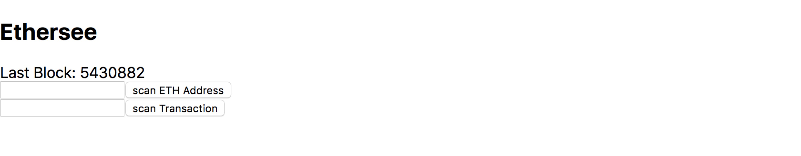
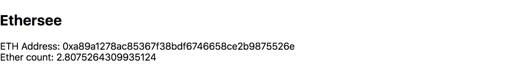
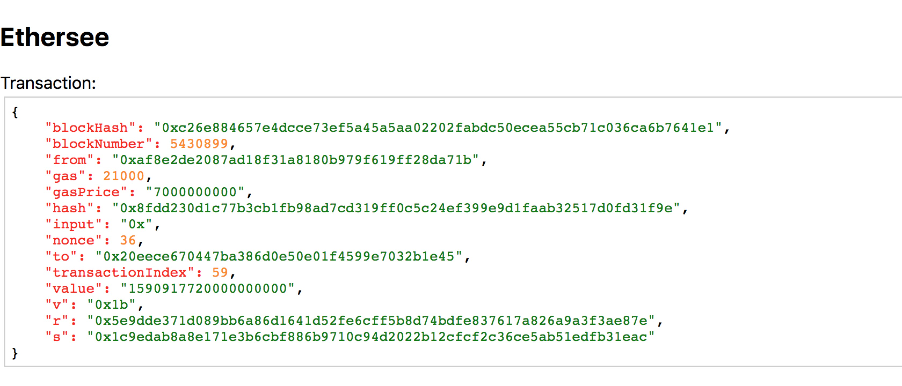

# Ethersee

Simple Ethereum Explorer build on web3 and infura using React. Demo is here: <a href="https://ethersee.wanglei.io/" target="_blank">Ethersee</a>

## Run
Clone the project then install dependencies.
``` shell
npm install
npm run dev
```
Then you can access it at localhost:9000
## More
Last block number.
<p align="center"></p>
Scan a ETH address.
<p align="center"></p>
Scan a Transaction.
<p align="center"></p>

## License
MIT
